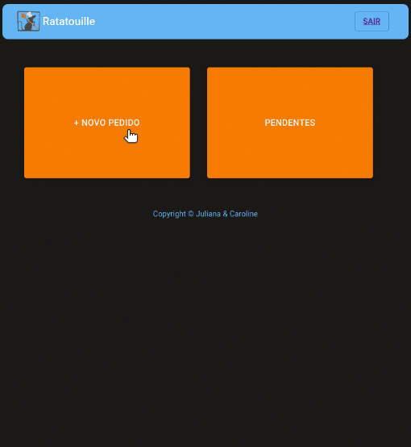
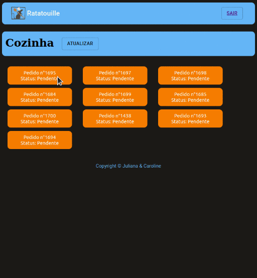

# Ratatouille Burger

Acesse a aplicação - [aqui](https://sap-005-burger-queen-amber.vercel.app/)

## Índice

- [1. Resumo do projeto](#1-resumo-do-projeto)
- [2.Protótipo](#2-Prototipo)
- [3. Planejamento](#3-Planejamento)
- [4. Desenvolvimento das histórias de usuário](#4-desenvolvimento-das-historias-de-usuarios)
- [5. Tecnologias Utilizadas](#5-tecnologias-utilizadas)

---

## 1. Resumo do projeto

Um pequeno restaurante de hambúrgueres chamado Ratatouille Burger está crescendo, 
e necessitava de uma interface em que se possa realizar pedidos utilizando um _tablet_,e enviá-los para a cozinha para que sejam preparados de forma ordenada e eficiente.
Os usuários desta aplicação são o cozinheiro e o garçom, portanto, esta aplicação 
foi desenvolvida com atenção para estes usuários, de tal forma que sua usabilidade
seja a mais simples possível aos mesmos, sendo que para cada tipo de usuário 
(cozinha/salão) seja disponibilizada somente a tela necessária para o mesmo poder 
trabalhar.

## 2.Protótipo
O tema da hamburgueria foi inspirado no filme rataoille, que é um filme sobre um ratinho vivendo em Paris que sonha em se tornar um chef de cozinha. Fizemos um prototipo pensando nas cores desta temática, com uma interface simples para que os usuários possam facilmente entender sua usabilidade. 

* Protótipo 1 
Protótipo inicial desenvolvido antes do teste de usabilidade com usuários.

* Protótipo 2
Protótipo incorporando o feedback dos usuários,. 

## 3. Planejamento.
O planejamento foi feito pelo método kanban por sprints, finalizando uma história por sprint. Utilizamos o trello como ferramenta.

## 4. Desenvolvimento das histórias de usuário

* [História de usuário 1]* Usuário deve ter seu perfil (login/senha) para acessar o sistema.

Eu como funcionário do restaurante quero entrar na plataforma e ver apenas a tela importante para o meu trabalho.

**Criar perfil*

- [ ] Poder realizar cadastro com e-mail, senha e função.
- [ ] Poder realizar login com e-mail e senha.
- [ ] Redirecionar para a tela correta.

* [História de usuário 2] Garçom/Garçonete deve poder anotar o seu pedido

Eu como garçom/garçonete quero poder anotar o meu pedido saber o valor de cada
produto e poder enviar o pedido para a cozinha para ser preparado.

**Anotar pedidos*

- [ ] Digitar o nome do cliente e mesa.
- [ ] Filtrar _menu_ para _café da manhã_ e _almoço/jantar_.
- [ ] Adicionar item ao pedido.
- [ ] Excluir item do pedido.
- [ ] Mostrar _resumo_ do pedido com todos os itens e o total.
- [ ] Enviar para a cozinha (isso deve salvar o pedido).

* [História de usuário 3] Chefe de cozinha deve ver os pedidos

Eu como chefe de cozinha quero ver os pedidos dos clientes em ordem, poder marcar que estão prontos e poder notificar os garçons/garçonetes que o pedido está pronto para ser entregue ao cliente.

**Ver pedidos na cozinha*

- [ ] Visualizar pedidos pendentes para produção.
- [ ] Marcar pedido como pronto para entrega.
- [ ] Ver histórico dos pedidos.

* [História de usuário 4] Garçom/Garçonete deve ver os pedidos prontos para servir

Eu como garçom/garçonete quero ver os pedidos que estão prontos para entregá-los rapidamente aos clientes.

**Entrega de pedidos*

- [ ] Visualizar pedidos pendentes para entrega.
- [ ] Marcar pedido como entregue ao cliente.

## 5. Tecnologias utilizadas

### API

 [Burger Queen API](https://lab-api-bq.herokuapp.com/api-docs/)

#### Framework / biblioteca

- [React](https://reactjs.org/)

#### Estilização

- [Material-UI](https://material-ui.com/)

#### Testando requisições

- [Insomnia](https://insomnia.rest/)
- [Postman](https://www.postman.com/)

#### Deploy

- [Deploy + Netlify (vídeo)](https://drive.google.com/file/d/1hzlB8dl4m0OnLLY2-WpjSLcU7eYTURRk/view)

---
