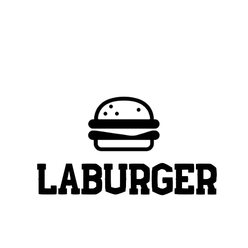

<h1>LaBurguer</h1>

## Índice

- [1. Introdução](#1-introdução)
- [2. Planejamento e Organização](#2-planejamento-e-organização)
- [3. Desing Sprint](#3-desing-sprint)
- [4. Desenvolvimento](#4-desenvolvimento)
- [5. Desenvolvedoras](#5-desenvolvedoras)
---

## 1. Introdução

Foi proposto pela [Laboratória](https://github.com/Laboratoria), um projeto por demanda onde o cliente é um pequeno restaurante de hambúrgueres que precisa de uma
interface onde possa realizar pedidos e enviá-los para a cozinha. Foi estabelecido o uso de [React](https://reactjs.org/) para o desenvolvimento da interface web [Single Page Application (SPA)](https://pt.wikipedia.org/wiki/Aplicativo_de_p%C3%A1gina_%C3%BAnica), que deve usar requisições da API fornecida e ser especificamente responsivo para tablets. 
O prazo de entrega foi de 4 sprins para cumprir com 4 histórias de usuários, com seus respectivos critérios de aceitação e definições de pronto.

### Sobre 

O LaBurguer é a hamburgueria para qual foi desenvolvido a aplicação que possibilite que os pedidos sejam executados e entregues de maneira organizada e prática.

---
## 2. Planejamento e Organização

O planejamento e organização do projeto foi feito com método Kanban, utilizando o [Trello](https://trello.com/). 

---
## 3. UX

Apesar de ser um projeto por demanda, desenvolvemos o design e todo o necessário para uma melhor experiência dos nossos usuários, no caso, os funcionários que trabalham no atendimento ao cliente, e cozinha, do LaBurger.

### Ideação

Estudamos as histórias de usuários, a fim de trazer para a aplicação a solução de suas necessidades no dia a dia de trabalho.

#### -História de usuário 1: Usuário deve ter seu perfil (login/senha) para acessar o sistema.
"Eu como funcionário do restaurante quero entrar na plataforma e ver apenas a tela importante para o meu trabalho."
##### Critérios de aceitação:
O que deve acontecer para satisfazer as necessidades do usuário?
- Criar login e senha.
- Registar tipo de usuário (cozinha / salão), login e senha.
- Entrar na tela correta para cada usuário.
##### Definição de pronto:
O acordado abaixo deve acontecer para dizer que a história está terminada:
- Você fez _testes_ de usabilidade e incorporou o feedback do usuário.
- Você deu deploy de seu aplicativo.

#### -História de usuário 2: Garçom/Garçonete deve poder anotar o seu pedido
"Eu como garçom/garçonete quero poder anotar o meu pedido saber o valor de cada
produto e poder enviar o pedido para a cozinha para ser preparado."
##### Critérios de aceitação:
O que deve acontecer para satisfazer as necessidades do usuário?
- Anotar o nome e mesa.
- Adicionar produtos aos pedidos.
- Excluir produtos.
- Ver resumo e o total da compra.
- Enviar o pedido para a cozinha (guardar em algum banco de dados).
- Funcionar bem e se adequar a um _tablet_.
##### Definição de pronto:
O acordado abaixo deve acontecer para dizer que a história está terminada:
- Você fez _testes_ de usabilidade e incorporou o _feedback_ do usuário.
- Você deu deploy de seu aplicativo.

#### -História de usuário 3: Chefe de cozinha deve ver os pedidos
"Eu como chefe de cozinha quero ver os pedidos dos clientes em ordem, poder marcar que estão prontos e poder notificar os garçons/garçonetes que o pedido está pronto para ser entregue ao cliente."
##### Critérios de aceitação:
- Ver os pedidos à medida em que são feitos.
- Marcar os pedidos que foram preparados e estão prontos para serem servidos.
- Ver o tempo que levou para preparar o pedido desde que chegou, até ser marcado como concluído.
##### Definição de pronto:
- Você fez testes de usabilidade e incorporou o feedback do usuário.
- Você deu deploy de seu aplicativo.

#### -História de usuário 4: Garçom/Garçonete deve ver os pedidos prontos para servir
"Eu como garçom/garçonete quero ver os pedidos que estão prontos para entregá-los rapidamente aos clientes."
##### Critérios de aceitação:
- Ver a lista de pedidos prontos para servir.
- Marque os pedidos que foram entregues.
##### Definição de pronto:
- Você fez testes de usabilidade e incorporou o feedback do usuário.
- Você deu deploy de seu aplicativo.
- Os dados devem ser mantidos intactos, mesmo depois que um pedido foi terminado. Tudo isso para poder ter estatísticas no futuro.

A partir o detalhamento das histórias de usuário e documentação do projeto, fizemos um fluxograma inicial das funcionalidades da aplicação.

 

### Prototipagem

Começamos desenvolvendo um protótipo de baixa fidelidade, onde surgiram as primeiras ideias sobre o design do projeto.
 

Escolhemos como ponto de inspiração, e partida, a própria [Laboratória](https://github.com/Laboratoria), gerando assim o nome do estabelecimento e paleta de cores utilizada para o desenvolvimento do design. 

Pesquisamos sites e aplicações de delivery de hamburguerias para entendermos qual o design usualmente utilizado nesse nicho de mercado.
Após, criamos o protótipo de alta-fidelidade com o [Figma](https://www.figma.com/) para tablets.

### Testes com usuários

Foram entrevistados hipotéticos usuários, que utilizaram a versão do protótipo de alta-fidelidade para testar o fluxo de tarefas. Também houve testes de usuários conforme o desenvolvimento do projeto, o que acarretou em alguma mudanças, como não ter o uso de imagens no menu, a localização de alguns botões, assim como algumas alterações no fluxo de uso.

## 4. Desenvolvimento

Como solicitado, a aplicação foi desenvolvida em [React](https://reactjs.org/) como um [Single Page Application (SPA)](https://pt.wikipedia.org/wiki/Aplicativo_de_p%C3%A1gina_%C3%BAnica), utilizando a API fornecida.

Durante o processo, mudanças foram adotadas para melhor desempenho da aplicação, baseada em testes de usuários.

Utilizamos CSS puro, com responsividade para tablet.

## Conheça nossa aplicação [aqui!](https://sap-005-burger-queen-git-feature-adicionais-ale-alves.vercel.app/)
Você pode acessar com os logins:
### Salão

email:

senha:

### Cozinha

email:

senha:

Ou criar o seu próprio login.

## 5. Desenvolvedoras

Desenvolvido por [Alessandra](https://github.com/ale-alve) e [Julia](https://github.com/JuliaTerin).

