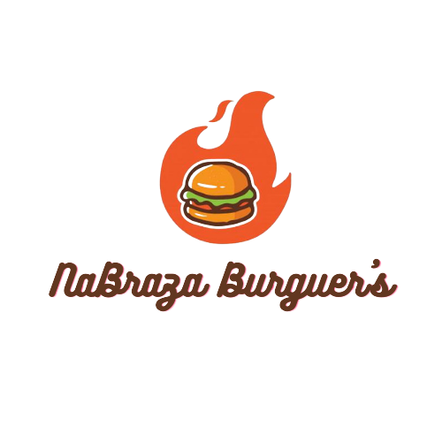
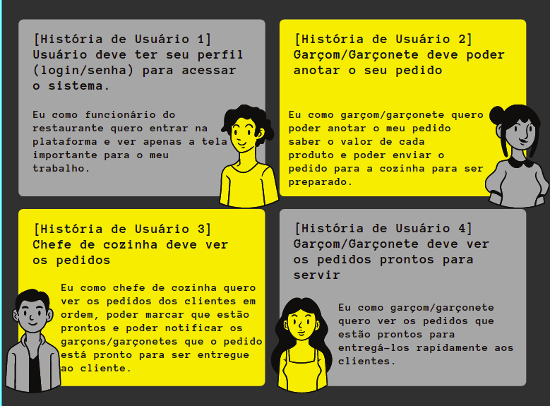
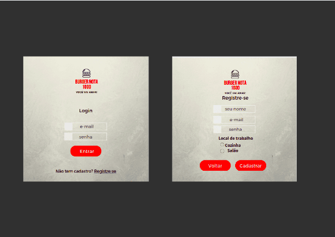
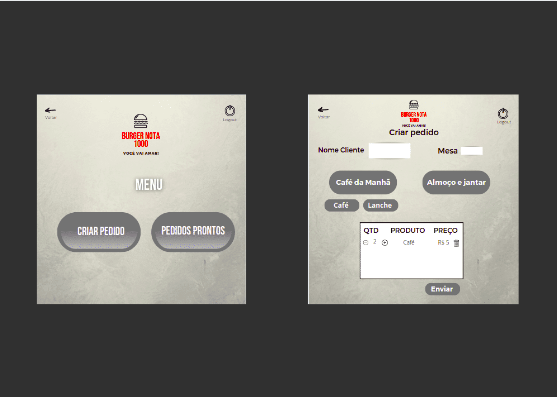
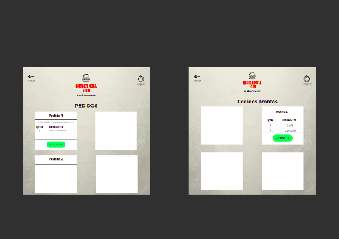

# Burger Nota 1000 

Aplicação para a hamburgueria: "Burger Nota 1000", em que com o uso de um _tablet_ possibilita que seus funcionários do salão possa enviar os pedidos à cozinha para que sejam preparados de forma ordenada e eficiente.
### Link para a aplicação
:hamburger: [Burguer Nota 1000](https://burger-nota-1000.vercel.app/)

Tabela de conteúdos
=================
<!--ts-->
   * [Sobre](#sobre-o-projeto)
   * [Tecnologias](#tecnologias)
   * [Design](#processo-de-design)
      * [Definição do produto](#definição-do-produto)
      * [Fluxo da Aplicação](#fluxo-da-aplicação)
      * [Protótipos](#protótipos)
      * [Versão final](#versão-final)
   * [Funcionalidades](#funcionalidades)
   * [Para desenvolvedorxs](#para-desenvolvedorxs)
   * [Desenvolvido por](#deselvolvido-por)
<!--te-->

---

## 💻 Sobre o projeto
Projeto elaborado durante o bootcamp da  <[Laboratoria](https://www.laboratoria.la/br)>, onde foi criado uma aplicação sob demanda para uma hamburgueria 24h, que está crescendo, necessita uma interface em que se possa realizar pedidos utilizando um _tablet_, e enviá-los para a cozinha para que sejam preparados de forma ordenada e eficiente.

---

## 🛠 Tecnologias
Lógica implementada em JavaScript (ES6 +), uso do [React](https://reactjs.org/), [Reactstrap](https://reactstrap.github.io/), teste de requisições de _API_ com [Postman](https://www.postman.com/) e _deploy_ realizado com [Vercel](https://vercel.com/) .O aplicativo é um _Single Page App_ e **responsivo** para _tablet_.

---

## 🎨 Processo de design

### Definição do produto

 O Product Owner nos apresentou este backlog que é o resultado do seu trabalho com o cliente até hoje:
 -  História de usuário

### Fluxo da aplicação

- Fluxograma

### Protótipos
  Foram realizados protótipos no [Canva](https://www.canva.com/) com o objetivo de realizar testes de usabilidade.

- Tela de Login e Cadastro

- Tela inicial do salão e do pedido(salão)

- Tela de pedidos em preparo(salão) e pedidos prontos(cozinha)

Após os testes de usabilidade, foram feitas alterações no _layout_ e esquema de cores. Foi verificado a necessidade de deixar em algo parecido com o esquema [_Dark_ _Mode_](https://en.wikipedia.org/wiki/Light-on-dark_color_scheme) o que deixaria a aplicação menos cansativa aos olhos, ao decorrer de longos períodos de uso.

### Versão final

---

## ⚙️ Funcionalidades

**Criar perfil**

- [x] Poder realizar cadastro com e-mail, senha e função.
- [x] Poder realizar login com e-mail e senha.
- [x] Redirecionar para a tela correta.

**Anotar pedidos**

- [x] Digitar o nome do cliente e mesa.
- [x] Filtrar _menu_ para _café da manhã_ e _almoço/jantar_.
- [x] Adicionar item ao pedido.
- [x] Excluir item do pedido.
- [x] Mostrar _resumo_ do pedido com todos os itens e o total.
- [x] Enviar para a cozinha (isso deve salvar o pedido).

**Ver pedidos na cozinha**

- [x] Visualizar pedidos pendentes para produção.
- [x] Marcar pedido como pronto para entrega.
- [x] Ver histórico dos pedidos.

**Entrega de pedidos**

- [x] Visualizar pedidos pendentes para entrega.
- [x] Marcar pedido como entregue ao cliente.

---
## 🚀 Para desenvolvedorxs
**Passo a passo**

- Leia a documentação da [Burger Queen API](https://lab-api-bq.herokuapp.com/api-docs/).

1. Antes de mais nada, se assegure de ter um bom :pencil: editor de texto, algo
   como o [Visual Studio Code](https://code.visualstudio.com/) ou [Atom](https://atom.io/).
2. Para executar os comandos você precisará de um :shell: UNIX Shell, que é um
   programa que interpreta linhas de comando (command-line interpreter) e também
   deve ter o git instalado. Se você usa um sistema operacional "UNIX-like",
   como GNU/Linux ou MacOS, você já tem um _shell_ (terminal) instalado (e
   provavelmente o `git` também). Se você usa Windows pode baixar a versão
   completa do [Cmder](https://cmder.net/) que inclue o [Git
   bash](https://git-scm.com/download/win) , embora seja recomendado que você
   teste :penguin: GNU/Linux. Se tem  Windows 10 ou superior pode usar o [Windows
   Subsystem for
   Linux](https://docs.microsoft.com/en-us/windows/wsl/install-win10).
3. Faça seu próprio :fork_and_knife:
   [fork](https://help.github.com/articles/fork-a-repo/) do repositório. Seus
   _mentores_ compartilharão com você um _link_ para um repositório privado e te
   darão acesso a este repositório.
4. :arrow_down: [Clone](https://help.github.com/articles/cloning-a-repository/)
   o _fork_ para seu computador (cópia local).
5. 📦 Instale as dependências do projeto rodando o comando `npm install`. Mas
   antes disso tenha certeza de ter instalado o [Node.js](https://nodejs.org/)
   (que inclui o [npm](https://docs.npmjs.com/)).
6. Instale o [Reactstrap](https://reactstrap.github.io/) e dependências de pares via NPM., rodando o comando `npm install --save reactstrap react react-dom`   
7. Para ver a interface do seu programa no navegador, use o comando `npm start`
   para iniciar o servidor web e entre na url `http://localhost:3000` no seu
   navegador.
- Let's Code! :rocket:

---
## :woman_technologist: Desenvolvido por

<a href="https://github.com/KarinaFS">
 
  
 <b>Karina Santos</b></a>  

 

<a href="https://github.com/RoSapia">
 
  
 <b>Roberta Vieira Sapia</b></a> 
 

 
