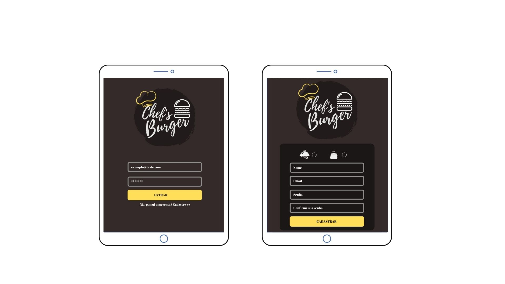

# Bem vinda(o) ao Chef's Burger!!!

# Acesse aqui
<b> *Acesse o Chef´s [Aqui](https://sap-005-burger-queen-luanagss.vercel.app/)

LOGIN DA(O) ATENDENTE:
E-MAIL: garçom@gmail.com
SENHA: 1234567

LOGIN DA(O) COZINHEIRA (O):
E-MAIL: cozinha@hotmail.com
SENHA: 1234567

## Índice

- [1. Preâmbulo](#1-preâmbulo)
- [2. Protótipos](#2-Protótipos)
- [3. História de usuário](#3-História-de-usuário)
- [4. Recursos Utilizados](#4-Recursos-Utilizados)
- [. Desenvolvido por](#-desenvolvido-por)

---

## 1. Preâmbulo

Chef's Burguer é um restaurante 24hs de hambúrgueres. Devido ao seu grande sucesso, passou a servir café da manhã, e precisou modernizar e agilizar o seu sistema de atendimento.

E assim surgiu o Chef's Burguer app, uma aplicação voltada para tablets, com uma interface prática no qual os pedidos são realizados rapidamente e enviádos para cozinha.

A todo momento, na tela de Históricos de Pedidos, pode ser feito o acompanhamento do status do pedido, tornando o atendimento do Chef's ainda mais eficiente, e fidelizando ainda mais os seus clientes.

## 2. Protótipos

## 3. História de usuário

- História de usuário 1

Eu como funcionário do restaurante quero entrar na plataforma e ver apenas a tela importante para o meu trabalho.

- História de usuário 2

Eu como atendente quero poder anotar o meu pedido saber o valor de cada
produto e poder enviar o pedido para a cozinha para ser preparado.

- História de usuário 3

Eu como chefe de cozinha quero ver os pedidos dos clientes em ordem, poder marcar que estão prontos e poder notificar os garçons/garçonetes que o pedido está pronto para ser entregue ao cliente.

- História de usuário 4

Eu como garçom/garçonete quero ver os pedidos que estão prontos para entregá-los rapidamente aos clientes.

# Necessidades do usuário:

História 1:

- Criar login e senha.
- Registar tipo de usuário (cozinha / salão), login e senha.
- Entrar na tela correta para cada usuário.

História 2:

- Anotar o nome e mesa.
- Adicionar produtos aos pedidos.
- Excluir produtos.
- Ver resumo e o total da compra.
- Enviar o pedido para a cozinha (guardar em algum banco de dados).
- Funcionar bem e se adequar a um _tablet_.

História 3:
- Ver os pedidos à medida em que são feitos.
- Marcar os pedidos que foram preparados e estão prontos para serem servidos.
- Ver o tempo que levou para preparar o pedido desde que chegou, até ser marcado como concluído.

História 4:
- Ver a lista de pedidos prontos para servir.
- Marque os pedidos que foram entregues.

## 4. Recursos Utilizados

- Lógica implementada em JavaScript (ES6 +). 
- [React](https://reactjs.org/).
- [react-router-dom](https://reactrouter.com/web/guides/quick-start)
- [Vercel](https://vercel.com/).
Configuração de ESLint

- [ESLint + Prettier](https://henriquetavares.com/pt-br/setting-eslint-on-reactjs-and-react-native/)

- Documentação da [Burger Queen API](https://lab-api-bq.herokuapp.com/api-docs/)

- Teste de requisições [Postman](https://www.postman.com/)

- Requisições com React [React + Fetch](https://jasonwatmore.com/post/2020/02/01/react-fetch-http-post-request-examples)

### .Desenvolvido por:
- [LuanaGss](https://github.com/LuanaGss)  
- [Tânagra Andria](https://github.com/TanagraAndria)

